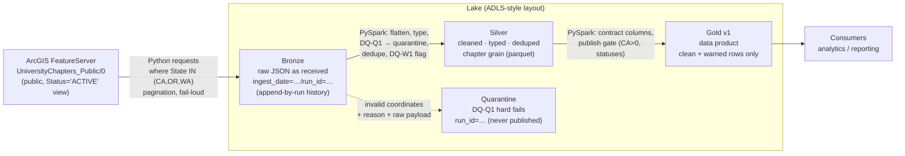

# Architecture Note

## Shape

A deliberately thin medallion pipeline: one source, three layers plus a quarantine
path, one published product. Everything runs locally with PySpark; every local
piece has a named Azure equivalent (mapping below).

## Layer responsibilities

- **Bronze** — evidence. The API payload exactly as received (plus an ingest-metadata
  sidecar). No business logic; append-by-run so every run is auditable and
  reprocessable. Partitioned by `ingest_date`, then `run_id`.
- **Silver** — trustworthy rows. Flattening, typing (`try_cast` so malformed values
  degrade to DQ failures, not job crashes), scope filter, **DQ-Q1 quarantine before
  dedupe** (a corrupt duplicate must not shadow a good record), dedupe to
  `chapter_id` grain, DQ-W1 warning flags.
- **Gold** — the product. Contract columns only, versioned path (`/v1/`), a publish
  gate that refuses empty/CA-zero/invalid-status snapshots. Consumers read this and
  nothing else.
- **Quarantine** — visibly separate path (not a status value in Gold): reason code,
  `ingest_run_id`, raw payload. Empties on clean runs, never feeds Gold.

## Local ↔ Azure mapping

| This repo (runnable anywhere) | Production on Azure |
|---|---|
| `lake/` folders on local disk | ADLS Gen2 containers (`bronze`/`silver`/`gold`/`quarantine`) |
| Parquet files | Delta Lake tables |
| Local PySpark (`local[*]`) | Azure Databricks or Fabric/Synapse Spark |
| `python -m pipeline.run_pipeline` | ADF / Fabric pipeline, daily 06:00 UTC trigger |
| Overwrite `gold/…/v1/` | Delta `MERGE` on `chapter_id` into `gold.university_chapters_v1` |
| Fail-loud exceptions + run summary JSON | Job failure → alerting (Monitor/Log Analytics), metrics to run tables |
| Fixture + pytest | Same tests in CI on PRs |

## Why these choices

- **Spark for Silver/Gold, requests for ingest.** The transform layer is where
  Spark-shaped thinking pays off (typed frames, window dedupe, column-level DQ);
  a REST GET needs none of that.
- **Two-path DQ, not one.** Hard fails and soft warnings have different consumers:
  quarantine is for engineers debugging the source, `dq_status` is for analysts
  deciding whether to trust a row. Mixing them (dropping warned rows, or publishing
  quarantined ones with a flag) destroys one of the two audiences.
- **Versioned Gold path.** `/v1/` makes breaking schema change an explicit,
  parallel-publish event rather than a silent mutation under consumers.
